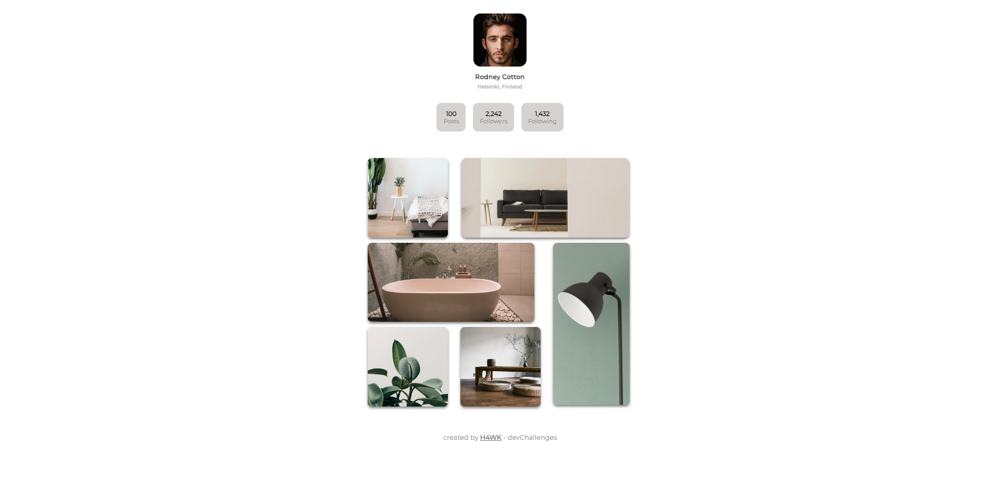

<!-- Please update value in the {}  -->

<h1 align="center">{My Galleryhttps://magenta-concha-c125ad.netlify.app/}</h1>

   Solution for a challenge from  <a href="http://devchallenges.io" target="_blank">Devchallenges.io</a>.

  <h3>
    <a href="https://magenta-concha-c125ad.netlify.app/">
      Demo
    </a>
     | 
    <a href="https://devchallenges.io/solutions/auasNzFTP8pRGpH9Biyo">
      Solution
    </a>
     | 
    <a href="https://devchallenges.io/challenges/gcbWLxG6wdennelX7b8I">
      Challenge
    </a>
  </h3>

<!-- TABLE OF CONTENTS -->

## Table of Contents

- [Overview](#overview)
  - [Built With](#built-with)
- [Features](#features)
- [Contact](#contact)
- [Acknowledgements](#acknowledgements)

<!-- OVERVIEW -->

## Overview

### Built With

<!-- This section should list any major frameworks that you built your project using. Here are a few examples.-->

- [HTML]
- [CSS]

## Features

<!-- List the features of your application or follow the template. Don't share the figma file here :) -->

This application/site was created as a submission to a [DevChallenges](https://devchallenges.io/challenges) challenge. The [challenge](https://devchallenges.io/challenges/gcbWLxG6wdennelX7b8I) was to build an application to complete the given user stories.

## Contact

- Website [nikhilcodes.me](https://nikhilcodes.me)
- GitHub [@nikhilcodes0](https://github.com/nikhilcodes0)
- Twitter [@nikhil__codes](https://twitter.com/nikhil__codes)
